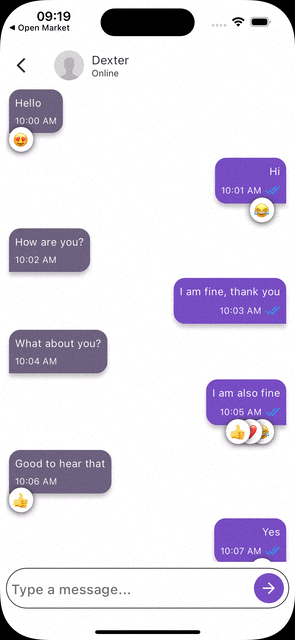

<!--
This README describes the package. If you publish this package to pub.dev,
this README's contents appear on the landing page for your package.

For information about how to write a good package README, see the guide for
[writing package pages](https://dart.dev/guides/libraries/writing-package-pages).

For general information about developing packages, see the Dart guide for
[creating packages](https://dart.dev/guides/libraries/create-library-packages)
and the Flutter guide for
[developing packages and plugins](https://flutter.dev/developing-packages).
-->

# flutter_chat_reactions

`flutter_chat_reactions` Enhance your Flutter chat with expressive reactions.
Need a simple and powerful way to add customizable message reactions to your Flutter chat app? Look no further than flutter_chat_reactions!

Liked some of my work? Buy me a coffee. Thanks for your support :heart:

<a href="https://www.buymeacoffee.com/raphaelsqu7" target="_blank"></a>


[](demo_light.gif)
[](demo_dark.gif)

## Features

 - Reaction Dialog: Upon long-pressing the chat widget, a user-friendly dialog appears, offering a range of expressive reactions.
 - Compact Layout: The reactions are presented in a clean column layout, with the first child being a row containing six default reactions. A convenient '+' sign allows users to access an extended emoji container for even more reaction options.
 - Context Menu: Below the message widget, users can access a context menu, adding depth to the interaction within the chat application.
 - customizable Widgets: Reactions and Context Menu can be customized.

## Getting started

Add dependency to `pubspec.yaml`

```dart
dependencies:
  flutter_chat_reactions: <latest-version>
```
In your dart file, import the library:

 ```Dart
import 'package:flutter_chat_reactions/flutter_chat_reactions.dart';
 ``` 

## Usage

1. First wrap your `Widget` with a `Hero` Widget:

```dart
    Hero(tag: message.id,
      child: MessageWidget(message: message),
),
```

2. Wrap your `Hero` Widget with a `GestureDetector` or `Inkwell` Widget:

```dart
    GestureDetector(
                      // wrap your message widget with a [GestureDectector] or [InkWell]
                      onLongPress: () {
                        // navigate with a custom [HeroDialogRoute] to [ReactionsDialogWidget]
                      },
                      // wrap message with [Hero] widget
                      child: Hero(
                        tag: message.id,
                        child: MessageWidget(message: message),
                      ),
                    );
```

3. OnLonPress, navigate with `HeroDialogRoute` to `ReactionsDialogWidget` See example for more:

```dart
    GestureDetector(
                      // wrap your message widget with a [GestureDectector] or [InkWell]
                      onLongPress: () {
                        // navigate with a custom [HeroDialogRoute] to [ReactionsDialogWidget]
                        Navigator.of(context).push(
                          HeroDialogRoute(
                            builder: (context) {
                              return ReactionsDialogWidget(
                                id: message.id, // unique id for message
                                messageWidget: MessageWidget(message: message,), // message widget
                                onReactionTap: (reaction) {
                                  print('reaction: $reaction');

                                  if (reaction == '➕') {
                                    // show emoji picker container
                                  } else {
                                    // add reaction to message
                                  }
                                },
                                onContextMenuTap: (menuItem) {
                                  print('menu item: $menuItem');
                                  // handle context menu item
                                },
                              );
                            },
                          ),
                        );
                      },
                      // wrap message with [Hero] widget
                      child: Hero(
                        tag: message.id,
                        child: MessageWidget(message: message,),
                      ),
                    );
```

4. Don't forget to add the `StackedReactions` widget to your `messageWidget` or you can create your own custom `reaction widget` See example for more:

```dart
    Stack(
          children: [
            // your message
            buildMessage(
              context,
            ),

            // reactions
            Positioned( // the position where to show your reaction
            bottom: 4,
            right: 20,
            child: StackedReactions( // reactions widget
              reactions: message.reactions, // list of reaction strings
              stackedValue: 4.0, // Value used to calculate the horizontal offset of each reaction
            ),
          )
          ],
        ),
```

### ReactionsDialogWidget Parameters:
| Name | Description | Required | Default value |
|----|----|----|----|
|`reactions`| Unique id for message and Hero Widget | required | - |
|`messageWidget` | The message widget to be displayed in the dialog | required | - |
|`onReactionTap`| The callback function to be called when a reaction is tapped | required | - |
|`onContextMenuTap`| The callback function to be called when a context menu item is tapped | required | - |
|`reactions` | The list of reactions to be displayed | no | like, love, haha, wow, sad, angry and plus for more |
|`menuItems` | The list of menu items to be displayed in the context menu | no | `Reply, Copy and Delete` |
|`widgetAlignment` | The alignment of the widget | no | aligned to center right |
|`menuItemsWidth` | The width of the menu items | no | 45% of the screen width |


## Other Widgets
`StackedReactions` A seperate reactions widget for displaying reactions, you can wrap this with a positioned widget.

### StackedReactions Parameters:
| Name | Description | Required | Default value |
|----|----|----|----|
|`reactions`| The list of reactions to be displayed | required | - |
|`size` | A double, size of the reaction string (text) | no | 20.0 |
|`stackedValue`| A double, value used to calculate the horizontal offset of each reaction | no | 4.0 |
|`direction`| Stacked reactions direction (LTR or RTL) | no | TextDirection.ltr |

## Contributions

   All contributions are welcome!

